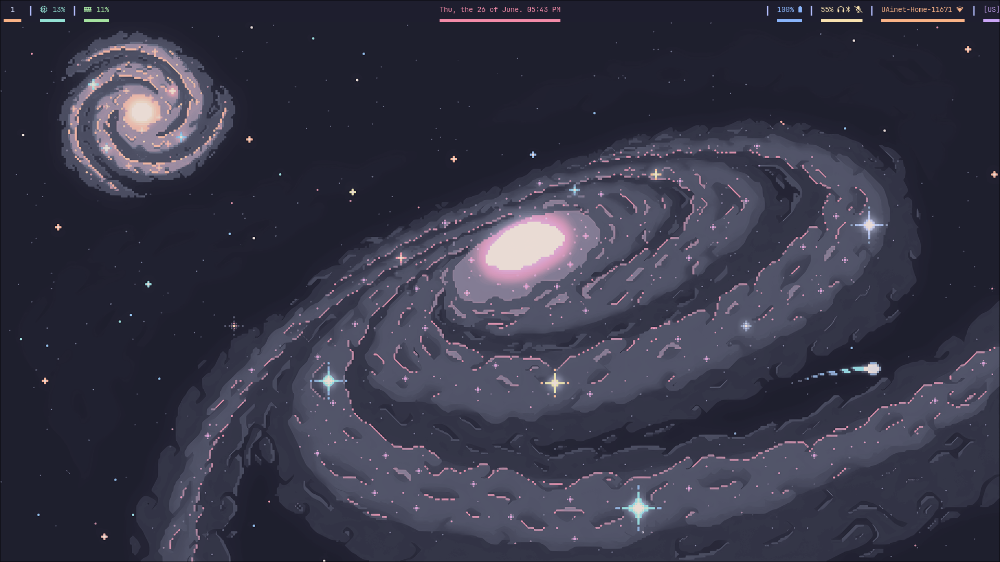
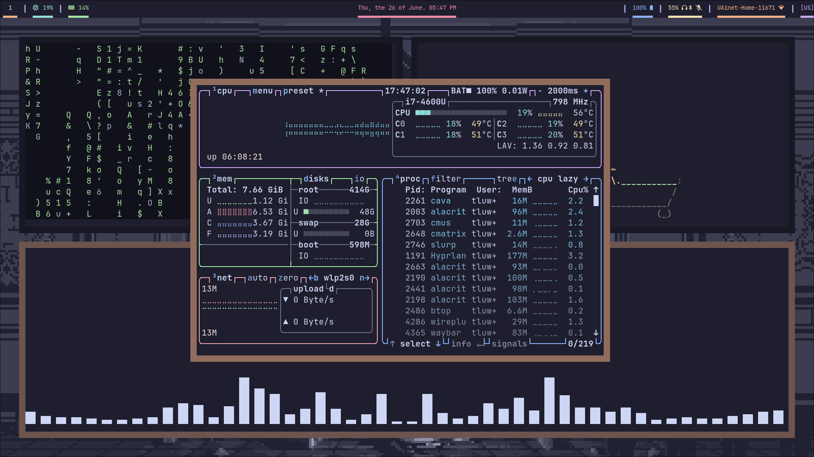

# Welcome
This is my catppuccin dots that i create on void linux.
~Hello world~

# Screenshots




# Soft
- **OS** <- Void linux
- **Window Manager** <- Hyprland
- **Font** <- JetBrainsMono Nerd Font
- **App launcher** <- fuzzel
- **Browser** <- firefox
- **TERMINAL** <- alacritty
- **Wallpaper tool** <- swww
# Installation
1. Install a necessary packages
```bash
        doas xbps-install wayland vim hyprland hyprlock hypridle cmus xdg-utils xdg-user-dirs elogind dbus cava cmatrix fish-shell Waybar fastfetch alacritty btop fuzzel qt5ct qt6ct starship git gsettings-desktop-schemas tuigreet curl grim slurp mesa-dri
```
2. Clone the repository
```bash
    git clone https://github.com/tluwun/catppuccin-dots.git
    ```
3. Copy the configs in $HOME/.config and vimrc
4. copy scripts in $HOME/.local/bin/

5. Copy wallpaper in your directory with wallpapers and set it
6. Enjoy ⭐

