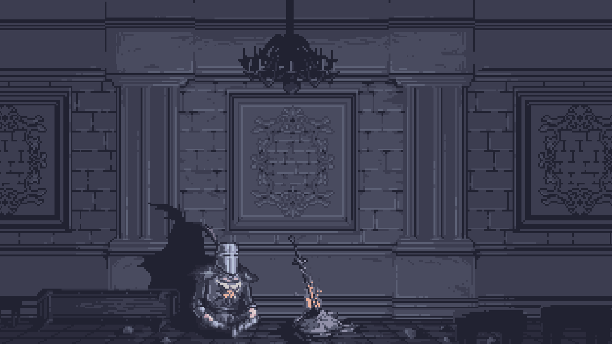
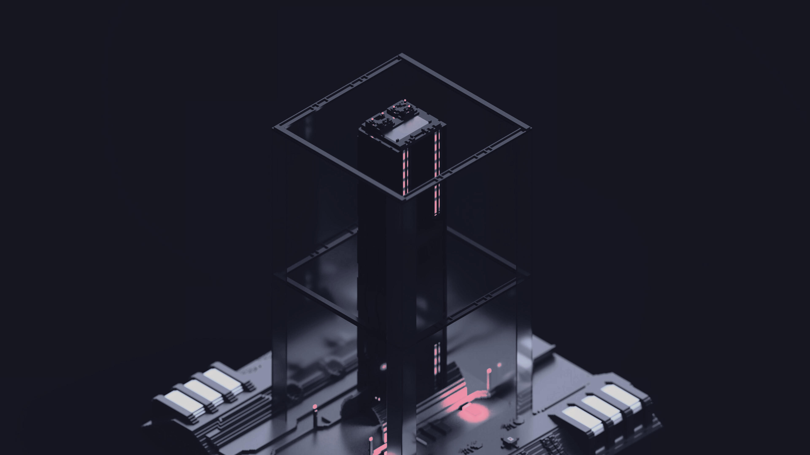

# Welcome
This is my catppuccin dots that i create on void linux.

# Screenshots


# Soft 
- **OS** <- Void linux
- **Window Manager** <- Hyprland
- **App launcher** <- fuzzel
- **Browser** <- firefox
- **TERMINAL** <- alacritty
- **Wallpaper tool** <- swww
- **File Manager** <- Nemo
- **Shell** <- fish
- **Notification Daemon** <- dunst

# Themes 
- **Font Theme** <- JetBrainsMono Nerd Font
- **Gtk Theme** <- [Catppuccin-Mocha-Standard-Blue-Dark](https://www.pling.com/p/1996672)
- **Icon theme** <- [Catppuccin-Mocha-Alt2](https://www.pling.com/p/1715570)
- **Cursor Theme** <- [Bibata-Modern-Classic](https://www.pling.com/p/1914825)

# Wallpapers

## Wallpaper №1


## Wallpaper №2


## Wallpaper №3


## Wallpaper №4


## Wallpaper №5


## Wallpaper №6


## Wallpaper №7


## Wallpaper №8


All these wallpapers i take from https://github.com/orangci/walls-catppuccin-mocha
# Installation

1. Install a necessary packages
```bash
# xbps-install vim hyprland hyprlock hypridle cmus xdg-utils xdg-user-dirs cava cmatrix fish-shell Waybar fastfetch alacritty btop fuzzel qt5ct qt6ct starship git gsettings-desktop-schemas curl grim slurp wl-clipboard cliphist
```
2. Clone the repository
```bash
$ git clone https://github.com/tluwun/catppuccin-dots.git
```
3. Copy the configs in $HOME/.config and vimrc
```bash
$ cp -r catppuccin-dots/configs/* $HOME/.config/
$ cp catppuccin-dots/vimrc $HOME/.vimrc
```
4. Copy scripts in $HOME/.local/bin/
```bash
$ mkdir $HOME/.local/bin
$ cp catppuccin-dots/scripts/* $HOME/.local/bin
```

5. Copy wallpaper in your wallpapers directory and set it
```bash
$ cp -r catppuccin /path/to/your/wallpaper/dir
```
# Shortcuts

- **Open Terminal**: `Super + Return`
- **Close Window**: `Super + Q`
- **Open app launcher**: `Super + M`
- **Select emoji**: `Super + E`
- **Open clipboard menu**: `Super + C`

Enjoy ⭐
